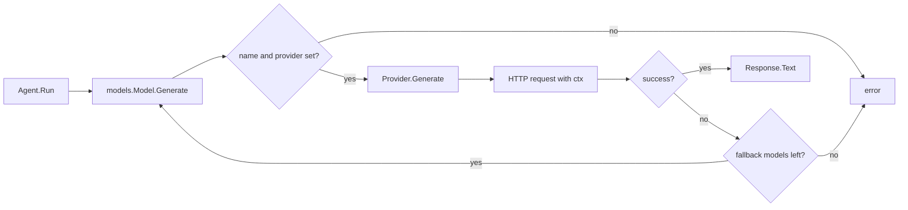

# tango


A minimal agent framework for Go. Define an agent with a system prompt, a set of
instructions, and a model; call `Run` and get a string back. Providers sit behind
a single-method interface, so swapping or adding a backend touches nothing else.

The library is deliberately small. There is no DSL, no code generation, and no
runtime graph — an agent is a struct, and running it is a method call.

## Features

- Single-method `Provider` interface — implement `Generate` and you have a backend
- Automatic fallback to a list of secondary models when the primary fails
- Context propagation end to end, so cancellation and timeouts reach the HTTP call
- System prompt and instructions composed independently of the user input
- OpenAI Responses API provider with configurable endpoint for proxies and
  OpenAI-compatible servers
- One external dependency (`google/uuid`); everything else is the standard library

## Install

```sh
go get github.com/zraisan/tango
```

## Quick Start

```go
package main

import (
	"context"
	"fmt"
	"log"
	"os"

	"github.com/zraisan/tango"
	"github.com/zraisan/tango/models"
	"github.com/zraisan/tango/providers/openai"
)

func main() {
	provider := openai.New(os.Getenv("OPENAI_API_KEY"))
	model := models.New("gpt-4.1-mini", provider)

	agent := tango.NewAgent(tango.Agent{
		Name:         "assistant",
		Model:        model,
		SystemPrompt: "You are a helpful assistant.",
		Instructions: []string{"Answer clearly and concisely."},
	})

	response, err := agent.Run(context.Background(), "Say hello in one sentence.")
	if err != nil {
		log.Fatal(err)
	}

	fmt.Println(response)
}
```

Run it:

```sh
export OPENAI_API_KEY=sk-...
go run ./examples/simple
```

## Request Flow



`Model` is a thin wrapper that validates configuration and stamps the model name
onto the request before handing it to the provider. The provider is the only
layer that knows about HTTP or vendor-specific payloads.

## Fallback Models

When the primary model returns an error, the agent walks `FallbackModels` in
order and returns the first successful response. If every model fails, the last
error is returned.

```go
agent := tango.NewAgent(tango.Agent{
	Name:  "assistant",
	Model: models.New("gpt-4.1", provider),
	FallbackModels: []models.Model{
		models.New("gpt-4.1-mini", provider),
		models.New("gpt-4o-mini", backupProvider),
	},
})
```

Fallbacks cover provider outages, rate limits, and model deprecations. Because
the same `ctx` is passed to every attempt, a cancelled context short-circuits the
whole chain rather than retrying against a deadline that has already passed.

## Cancellation and Timeouts

Every call takes a `context.Context` that reaches the underlying HTTP request.

```go
ctx, cancel := context.WithTimeout(context.Background(), 30*time.Second)
defer cancel()

response, err := agent.Run(ctx, "Summarise this report.")
```

In an HTTP handler, pass `r.Context()` directly — the model call is torn down as
soon as the client disconnects.

## Custom Endpoints

`openai.New` accepts an optional endpoint, which makes the provider usable against
proxies, gateways, and OpenAI-compatible servers.

```go
provider := openai.New(apiKey, "https://my-gateway.internal/v1/responses")
```

## Writing a Provider

A provider is anything that satisfies one method:

```go
type Provider interface {
	Generate(ctx context.Context, req Request) (*Response, error)
}
```

`Request` carries the model name, system prompt, instructions, and input;
`Response` carries the generated text. Marshal the request into whatever shape
the vendor expects, honour `ctx` on the outbound call, and map the reply back.

Wrap it with `models.New(name, provider)` and it composes with agents, fallbacks,
and everything else unchanged.

## Source Layout

```
tango/
├── agent.go              Agent definition, sessions, message types, Run loop
├── models/
│   └── model.go          Provider interface, Model wrapper, Request/Response
├── providers/
│   └── openai/
│       └── openai.go     OpenAI Responses API provider
├── examples/
│   └── simple/           Minimal single-turn example
├── cmd/tango/          CLI entry point (placeholder)
└── internal/             Internal packages
```

## Status

Alpha. The core path — agent, model, provider, fallbacks, cancellation — works
and is stable in shape. Conversation history is under active development and the
API around it will change.

Implemented:

- Agent configuration and construction via `NewAgent`
- Model wrapper with validation
- Fallback chain
- OpenAI Responses API provider
- Session and message types (`Session`, `Message`, `Role`)

In progress:

- Recording turns into a session and replaying them as history
- `NumHistoryMessages` windowing, sliced on turn boundaries so a user message is
  never separated from its reply
- Carrying `[]Message` through `models.Request` and into provider payloads

Planned:

- Pluggable session storage behind an interface, so history can live in memory,
  on disk, or in a database
- Tool and function calling
- Streaming responses
- Additional providers

## Development

```sh
go build ./...
go vet ./...
go test ./...
```

## Contributing

Issues and pull requests are welcome. A few preferences:

- Run `gofmt -s` and `go vet ./...` before opening a pull request
- Keep the standard-library-first approach; new dependencies need justification
- New providers belong under `providers/<name>/` and should implement
  `models.Provider` without changing the interface
- Keep exported API surface small — prefer one obvious way to do a thing

Useful areas to help with: additional providers, streaming support, session
storage backends, and examples.

## License

Not yet specified. A license will be added before the first tagged release.
